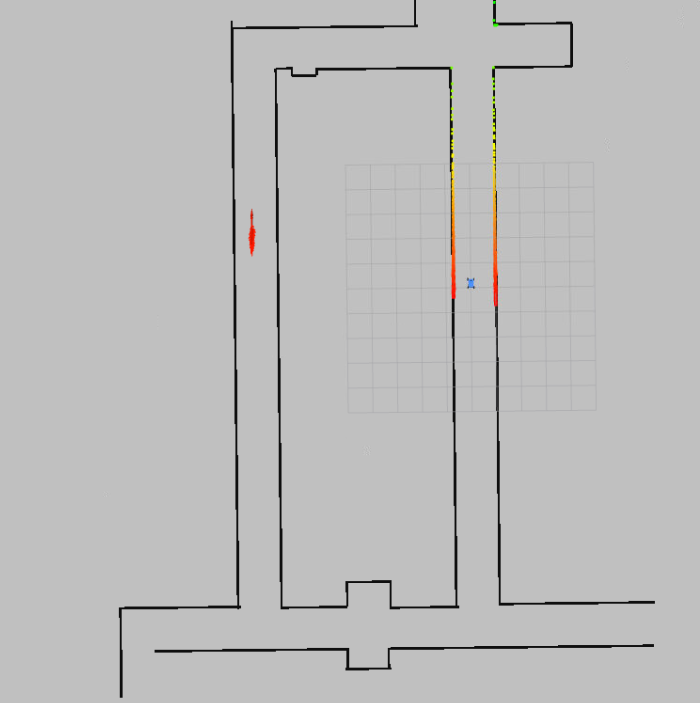
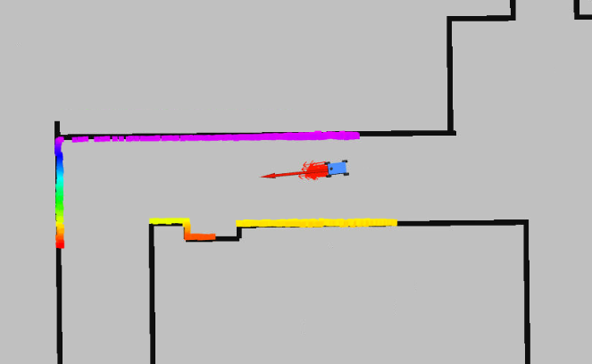
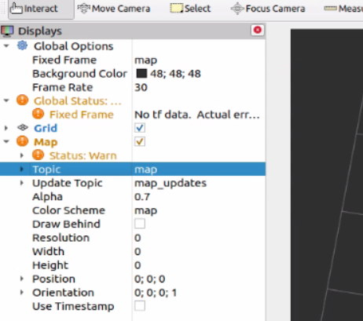
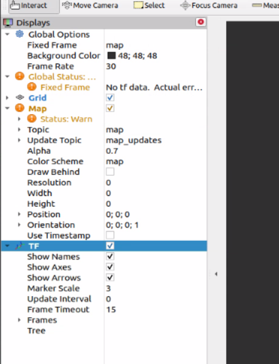
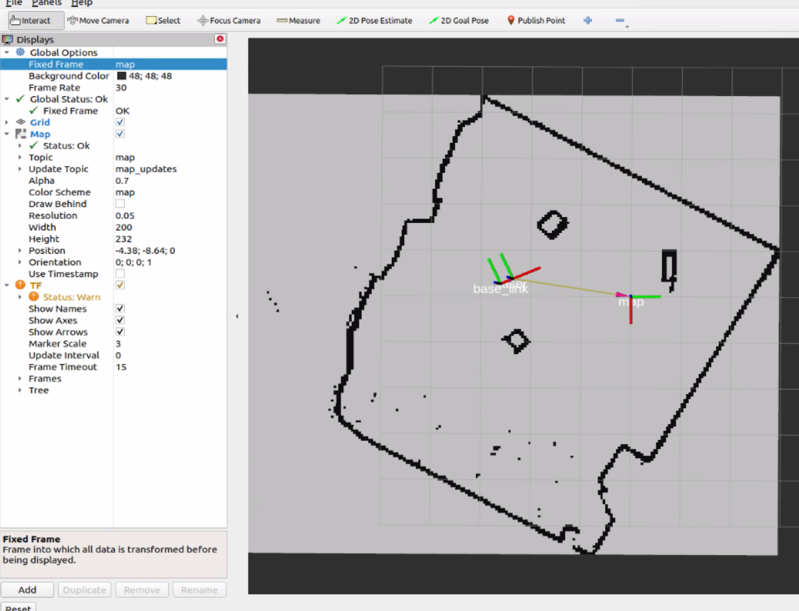

# Lab: Particle Filter

In this lab, you'll be learning how to use the particle filter.

Deliverables:

* Simulator demonstration: **15** points
* Vehicle demonstration: **15** points

Learning Goals:

* Learn how to use `particle_filter` to localize in the simulator and vehicle environments.
* Learn how to configure `particle_filter` to balance accuracy and frequency.

## Part 1: Particle Filter in the Simulator

This section covers how to use the particle filter inside your simulator environment.

The idea is that `particle_filter` tries to predict the pose (position and yaw) of the car within the `map` frame based on a particle filter algorithm. This information is available using odometry messages from `/pf/pose/odom` while  `particle_filter` is running.

### 1-1: Installation

Run the following to install `range_libc`:

```
cd /lab7_ws/src
git clone https://github.com/f1tenth/range_libc.git
cd range_libc/pywrapper
pip install Cython
WITH_CUDA=OFF python3 setup.py install
```

Then, install `particle_filter` using:

```
cd /lab7_ws/src
git clone https://github.com/f1tenth/particle_filter.git
rosdep install -r --from-paths particle_filter --ignore-src --rosdistro foxy -y
```

Then, go into `/lab7_ws/src/particle_filter/config/localize.yaml` and change the following

```yaml
    odometry_topic: '/odom'
    # ...
    range_method: 'rmgpu'
```

to

```yaml
    odometry_topic: '/ego_racecar/odom'
    # ...
    range_method: 'rm'
```

Then, build `particle_filter`:

```
cd /lab7_ws
colcon build --packages-select particle_filter
source /opt/ros/foxy/setup.bash
source install/local_setup.bash
```

**Note**: If you rebuild the container, you will need to reinstall these dependencies. If you want, you can adapt some of these commands to be added to your `Dockerfile` so it'll be run when it's rebuilding the container.

### 1-2: Running Particle Filter

In one terminal, launch `f1tenth_gym_ros` with the `levine` map.

In another terminal, run `particle_filter` using:

```
ros2 run particle_filter particle_filter \
    --ros-args \
    --params-file /lab7_ws/src/particle_filter/config/localize.yaml
```

`particle_filter` will use whatever map is currently loaded. On success, `particle_filter` will print something like the following:

```
...
[particle_filter-3] [INFO] [1776642984.506441904] [particle_filter]: ['iters per sec:', 16, ' possible:', 17]
[particle_filter-3] [INFO] [1776642985.050288708] [particle_filter]: ['iters per sec:', 18, ' possible:', 20]
[particle_filter-3] [INFO] [1776642985.559564867] [particle_filter]: ['iters per sec:', 20, ' possible:', 21]
[particle_filter-3] [INFO] [1776642986.101229930] [particle_filter]: ['iters per sec:', 18, ' possible:', 20]
...
```

If it doesn't work, try relaunching the `particle_filter`. If this doesn't work, try relaunching the gym then relaunching the `particle_filter`.

To verify that it works, add the following topics to RViz:

* `/pf/pose/odom`: Best pose predicted by `particle_filter`.
  * Set "Keep" to 1, so it only shows that last 1 odometry message.
* `/pf/viz/particles`: A subset of the particles tested by `particle_filter`.

You may add any other topic if you wish.

This will start visualizing what the `particle_filter` is doing. These visualizations should be shown somewhere on the map. It's very likely it's not anywhere near the car itself, since the walls of the Levine hall are very similar.



Next, open a third terminal and run:

```
ros2 run teleop_twist_keyboard teleop_twist_keyboard
```

Then, use "2D Pose Estimate" to teleport the car somewhere. This will also set the pose predicted by the `particle_filter`. Then, start driving the car around the map.

You should see that the pose and particles should start following the car as you drive:



That means that the car is localizing well, congratulations!

### 1-3: Simulator Demonstration

For your demonstration, launch the gym and run `particle_filter`, then show your `/pf/pose/odom` and `/pf/viz/particles` visualizations on the `levine` map, as you drive the car around the map.

### 1-4: Extras

#### Usage of Particle Filter in Simulator

The performance of `particle_filter` within the simulator will vary between computer and computer. Additionally, if you don't have a GPU, they may be much **slower** than it would be on the vehicle itself.

It is up to you if you wish to use `particle_filter` for testing inside the simulator. Here are some options:

* **With Particle Filter:** Use `particle_filter` by listening to `/pf/pose/odom`.
* **Gym-Provided Poses**: Use the gym's provided poses by listening to `/ego_racecar/odom`, which provides a fast and ~100% accurate representation of the car's position.
* **Your own simulated pose**: Try creating your own node to simulate the inaccuracy and frequency of the `particle_filter`.

#### Custom configurations

You can provide your own custom configurations by changing the parameter file:

```
ros2 run particle_filter particle_filter \
    --ros-args \
    --params-file my-localize-configuration.yaml
```

Keep this in mind when testing your own custom `localize.yaml` configurations.

## Part 2: The Particle Filter Stack on the Vehicle

This section covers how to use the particle filter on the vehicle.

### 2-1: The Particle Filter Stack

Log in on your account on the vehicle on the Desktop.

Open a new "Terminal" window, and open three terminals (three tabs).

In terminal 1, run RViz:

```
rviz2
```

Inside of RViz, ensure that there is a visualization of display type **Map**, and it's listening to the `/map` topic:



Then, add a **TF** visualization and enable **Show Names** and set **Marker Scale** to 3:



Next, make sure that you have access to the map files of the map you want to use for your particle filter. On the vehicle, you'll be using `~/ws/maps` to store your maps. For this tutorial, we will assume `my-map.yaml` is the name of your map.

In terminal 2, launch the *particle filter stack* using the map's YAML file path:

```
cd ~/ws
ros2 launch f1tenth_unlv_veh stack_pf_launch.py map_yaml:=maps/my-map.yaml
```

On success, it will launch all of the nodes on the stack, then, after a few seconds, `particle_filter` will start continuously logging to the console. For example:

```
...
[particle_filter-11] [INFO] [1718656776.834070336] [particle_filter]: ['iters per sec:', 51, ' possible:', 88]
[particle_filter-11] [INFO] [1718656777.042450208] [particle_filter]: ['iters per sec:', 49, ' possible:', 88]
[particle_filter-11] [INFO] [1718656777.238205024] [particle_filter]: ['iters per sec:', 51, ' possible:', 82]
[particle_filter-11] [INFO] [1718656777.440426400] [particle_filter]: ['iters per sec:', 51, ' possible:', 87]
[particle_filter-11] [INFO] [1718656777.658124864] [particle_filter]: ['iters per sec:', 46, ' possible:', 77]
[particle_filter-11] [INFO] [1718656777.861813024] [particle_filter]: ['iters per sec:', 50, ' possible:', 79]
[particle_filter-11] [INFO] [1718656778.076763712] [particle_filter]: ['iters per sec:', 46, ' possible:', 76]
[particle_filter-11] [INFO] [1718656778.293226368] [particle_filter]: ['iters per sec:', 47, ' possible:', 76]
[particle_filter-11] [INFO] [1718656778.501512192] [particle_filter]: ['iters per sec:', 49, ' possible:', 79]
...
```

In RViz, you should see that the map shows up, and the TF tree is there:



Use the controller to move the car around the physical world. You should see that the location of the car's frames (`base_link` and `laser`) update in real-time inside of RViz.

If the car's frames inside of RViz is inaccurate, you may use **2D Pose Estimate** to reset the particle filter's pose using the pose you draw.

You may add any of the other visualization as described in the previous section, if you wish.

In terminal 3, run:

```
ros2 topic hz /pf/pose/odom
```

This command listens to the `/pf/pose/odom` and prints its frequency. Keep this command in mind when you are configuring your `localize.yaml` file.

### 2-2: Launching with a configuration file

By default, the particle filter stack uses the `localize.yaml` file located within the `f1tenth_unlv_veh` package. It's suggested to put your team's configuration files within `~/ws/config`.

To use your own configuration, you'll use the `localize_config` argument. For example, if there is a file named `my-localize.yaml` located within `~/ws/config`, then the command will be:

```
cd ~/ws
ros2 launch f1tenth_unlv_veh stack_pf_launch.py \
    map_yaml:=maps/my-map.yaml \
    localize_config:=config/my-localize.yaml
```

### 2-3: Vehicle Demonstration

To complete your vehicle demonstration, your team must be able to launch the particle filter stack, and show within RViz that it successfully localizes using two different configurations:

* Configuration 1: `/pf/pose/odom` is published to at a rate of **at least 30 Hz**.
* Configuration 2: `/pf/pose/odom` is published to at a rate of **at most 15 Hz**.

You may use `~/ws/src/f1tenth_unlv_veh/config/localize.yaml` as a base for the configuration. (Use `cp` to copy it.) The three most important parameters are:

* `max_particles`: The most important parameter. This is the maximum number of parameters used the Particle Filter algorithm.
    * Higher --> More accurate but more expensive 
* `angle_step`: Parameter for downsampling range values from laser scans. For example, if it is 18, then it takes every 18th range in your laser scan.
    * Higher --> Faster but less accurate
* `squash_factor`: The higher it is, the more equal the weights for each of the particles are. New weights are calculated as `newweight = oldweight ^ (1/squashfactor)`.

### 2-4: Tips for Configuration

Keep in mind that the performance of your particle filter **varies with each map**, depending on its size and complexity. So, for races, you may want to have several configuration files ready, and benchmark each of them on the map.

I recommend running both the particle filter stack AND your driver (e.g. pure pursuit) node at the same time. Then, examine the frequency of `/drive` and `/pf/pose/odom` at the same time.

Here are some questions to ask:

* What is a good threshold for frequency below which the performance of my car will be adversely affected? 15 Hz? 10 Hz? 8 Hz?
* Is my particle filter giving accurate enough pose estimates at the frequency it's running at?
* How accurate is my particle filter at low and high speeds?
